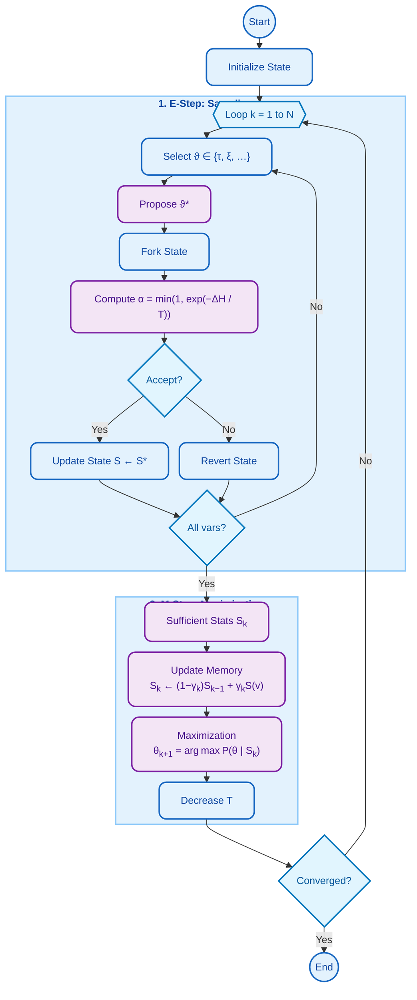

# McmcSaemCompatibleModel

**Module:** `leaspy.models.mcmc_saem_compatible`
**Inherits from:** [`StatefulModel`](StatefulModel.md)

`document: leaspy.models.mcmc_saem_compatible.McmcSaemCompatibleModel`

`McmcSaemCompatibleModel` is the **bridge** between the generic MCMC-SAEM algorithm and a specific mathematical model. While [`StatefulModel`](StatefulModel.md) provides the variables (the `State`), this class defines the **interface** and methods required to optimize them.

It guarantees that the algorithm can perform its two main iterative steps without knowing the underlying model details:
1.  **E-Step**: Sampling individual latent variables (like $\tau_i, \xi_i$).
2.  **M-Step**: Updating population parameters (like $g, v_0$).

## The Optimization Contract

The class enforces three core methods that drive the MCMC-SAEM loop:

1.  **`put_individual_parameters(state, dataset)`** (E-Step)
    Used to initialize or inject individual latent variables into the state. Concrete models (like `LogisticModel`) implement this to map the dataset inputs into the model's specific latent variables.

2.  **`compute_sufficient_statistics(state)`** (M-Step, Part 1)
    After sampling, the algorithm needs to summarize the current state. This method aggregates **sufficient statistics** from all `ModelParameter` nodes in the DAG. It computes the minimal set of numbers (sums, counts) needed to update parameters, rather than storing every sample.

3.  **`update_parameters(state, sufficient_statistics, burn_in)`** (M-Step, Part 2)
    Updates the population parameters using the computed statistics. This is done in a **batch** operation: all new values are computed first, then applied simultaneously to avoid order-dependent inconsistencies. The `burn_in` flag controls whether the update step uses a "memoryless" approach (faster adaptation) or standard recursive averaging.

## Other Responsibilities

Beyond the optimization loop, this class handles:
*   **Observation Models**: Wraps the noise model (e.g., Gaussian noise), providing the likelihood function (`nll_attach`) needed to accept or reject samples.
*   **Individual Trajectories**: The `compute_individual_trajectory` method allows predicting a patient's score **after** the model is trained, effectively powering the `personalize` feature.

## The Algorithm Loop

The following diagram illustrates how the MCMC-SAEM algorithm interacts with this interface at each iteration:

